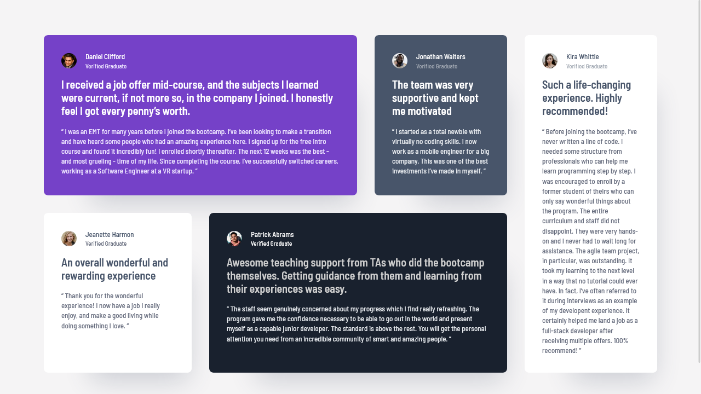

# Frontend Mentor - Testimonials grid section solution

This is a solution to the [Testimonials grid section challenge on Frontend Mentor](https://www.frontendmentor.io/challenges/testimonials-grid-section-Nnw6J7Un7). Frontend Mentor challenges help you improve your coding skills by building realistic projects. 

## Table of contents

- [Overview](#overview)
  - [Screenshot](#screenshot)
  - [Links](#links)
- [My process](#my-process)
  - [Built with](#built-with)
  - [What I learned](#what-i-learned)
  - [My favourite code](#my-favourite-code)
  - [Useful resources](#useful-resources)
- [Author](#author)
- [Acknowledgments](#acknowledgments)


## Overview

### Screenshot


<div style="display: flex; gap: 0.5rem;">
  
  
</div>


### Links

- Solution URL: [Testimonials grid section Solution](https://github.com/kapil-2695/fmc-testimonial-grid-section)
- Live Site URL: [Live site - Testimonials grid section](https://kapil-2695.github.io/fmc-testimonial-grid-section)


## My process
  
### Built with

- Semantic HTML5 markup
- CSS custom properties
- CSS Grid, `grid-area` and `grid-template` together
- CSS `clamp()` function
- CSS media query
- Nested modern CSS.


### What I learned

- I learned to make use of the Grid layout using grid areas and grid-template together.
- I learned about nested syntax of modern CSS.


### My favourite code

The colour schemes for each testimonial using Nested CSS:
```css
.test-1.color {
    background-color: var(--clr-purple-500);
    .test__author-name { color: var(--clr-white);}
    .test__author-desg { color: var(--clr-purple-50);}
    .test__heading { color: var(--clr-white);}
    .test__text { color: var(--clr-purple-50);}
}
```

The use of `grid-area` and `grid-template` together:
```css
@media screen and (min-width: 74rem){
    .testimonials {
        grid-template: repeat(2, 1fr) / repeat(2, 16.875rem) repeat(2, 1fr);
        grid-template-areas: 
            "test-1 test-1 test-2 test-5"
            "test-3 test-4 test-4 test-5";
        max-width: 70rem;
    }
}
```


### Useful resources

- [Learn CSS - web.dev](https://web.dev/learn/css/) - This helped me with CSS code.


## Author

- Frontend Mentor - [@kapil-2695](https://www.frontendmentor.io/profile/kapil-2695)


## Acknowledgments

- I want to thank CSS expert Kevin Powell for creating informative content on his YouTube channel which helped me a lot in perfecting the designs.
